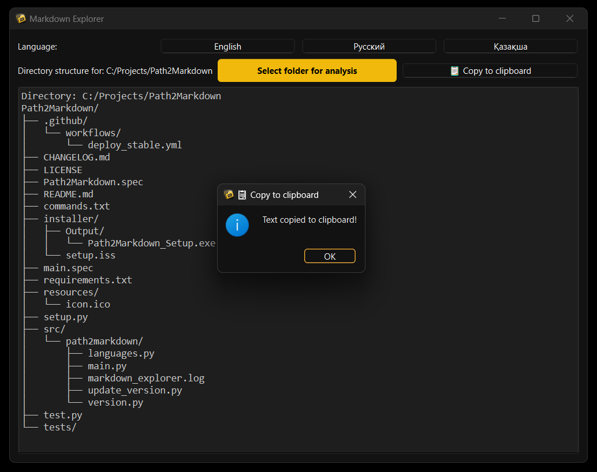
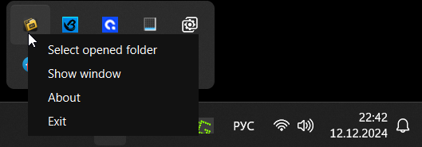
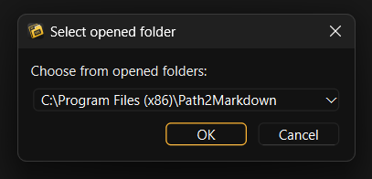
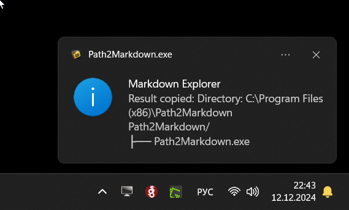
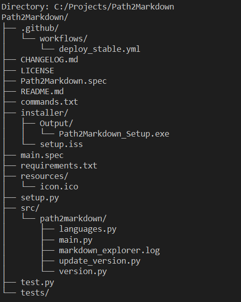

  

# Path2Markdown

  
  
  

**Languages:** [English](#english) | [Русский](#русский) | [Қазақша](#қазақша)

---

## English

**Path2Markdown** is a lightweight, user-friendly tool designed to transform your local folder structures into clean and understandable Markdown documents. This simplifies project navigation and comprehension for developers, AI assistants, and search engines. Currently optimized for **Windows**, Path2Markdown includes an **auto-start feature** that launches the application upon system startup, ensuring your documentation is always up-to-date. We welcome contributions to expand support for macOS and Linux!

---

### Screenshots

**Main UI**

**System Tray**

| Showing Window                                       | About Dialog                                           | Exit App                                                |
| :--------------------------------------------------- | :------------------------------------------------------ | :------------------------------------------------------ |
|              |                 |                 |

**Markdown Preview**
_Example of generated Markdown output._

### Features

-   **Convert Folder Structures:** Generates a Markdown file that neatly represents the entire directory tree of a selected folder.
-   **Clean & Readable Output:** Produces Markdown that's perfect for documenting codebases, providing AI tools with a clear project layout, or sharing project structures with teammates.
-   **System Tray Integration:** Offers convenient control directly from the system tray, allowing quick actions like folder selection and access to application settings without needing to open the main window.
-   **Language Support:** Features seamless switching between English, Russian, and Kazakh, catering to a diverse user base.
-   **Copy to Clipboard:** Enables users to instantly copy the generated Markdown structure to the clipboard with a single click, facilitating easy sharing and integration into project documentation.
-   **Log File Management:** Automatically creates and manages log files to track application activity, aiding in debugging and usage tracking.
-   **Select Open Folders:** Allows users to easily choose any folder currently open in Windows Explorer for documentation, streamlining the workflow.
-   **Windows & Autostart:** Designed to automatically run on system startup (specifically for Windows), ensuring that your project documentation is always current.
-   **Customizable UI:** Comes with a built-in dark mode and an intuitive, responsive interface for ease of use, enhancing the user experience.
-   **Error Handling:** Implements robust error handling for seamless folder traversal and logs any issues in real-time, ensuring reliability and user confidence.
-   **Version and Release Information:** Displays the current version and release date of the application, keeping users informed about updates.

### Libraries Used

-   **PySide6:** Used for creating the graphical user interface (GUI) and system tray integration.
-   **win32com.client:** Enables interaction with the Windows operating system, such as retrieving a list of open folders in Windows Explorer.
-   **logging:** For application activity logging.
-   **urllib.parse (unquote):** Used for decoding URLs, especially when dealing with file paths that may be URL-encoded.
-   **os, sys:** Standard Python libraries for operating system and system-specific functionalities.

### Why Path2Markdown?

Modern AI assistants and developers often require a quick and structured overview of a project's layout. Path2Markdown addresses this need by:

-   **Clarity:** Quickly displaying all directories and files within a project in a structured, easy-to-read Markdown format.
-   **AI Friendly:** Facilitating better Q&A sessions with AI by providing a clear map of your project in a format that many AI chat assistants understand well.
-   **Consistent Documentation:** Keeping your project's directory structure documentation updated effortlessly, thanks to the auto-start feature.

### Installation & Usage

1. **Download & Run the Installer:**
    Obtain the .exe installer from the [releases](https://github.com/elapen/Path2Markdown/releases). Install Path2Markdown, and it will automatically configure itself to run at system startup.

2. **Select a Folder:**
    Launch Path2Markdown and select a folder to instantly generate its Markdown representation. A copy button is provided for quickly copying the results into your documentation.

3. **Auto-start on Windows:**
    After installation, the application will automatically start with your system. You can disable auto-start by removing the application's shortcut from your Startup folder.

### Roadmap

-   **Multi-Platform Support:** Extend compatibility to include macOS and Linux operating systems.
-   **Advanced Filtering:** Introduce more customizable options for ignoring specific file types or directories during Markdown generation.
-   **Integration with CI/CD:** Allow for automatic updates to a project's documentation by committing changes directly to the repository.

### Contributing

Contributions are highly encouraged! Please refer to the [CONTRIBUTING.md](CONTRIBUTING.md) for detailed guidelines on how you can contribute. Whether it's adding new features, enhancing existing ones, or extending the tool's cross-platform capabilities, your help is greatly appreciated.

### License

Licensed under the [MIT License](LICENSE).

---

## Русский (RU)

**Path2Markdown** — это легкий и удобный инструмент, который преобразует структуру вашей локальной папки в понятный Markdown-документ. Это упрощает навигацию и понимание проекта для разработчиков, AI-ассистентов и поисковых систем. В настоящее время Path2Markdown оптимизирован для **Windows** и включает функцию **автозапуска** при старте системы, обеспечивая актуальность вашей документации. Мы приветствуем вклад в расширение поддержки macOS и Linux!

---

### Скриншоты

**Основной интерфейс**

**Системный трей**

| Отображение окна                                        | О программе                                             | Выход                                                   |
| :---------------------------------------------------- | :------------------------------------------------------- | :------------------------------------------------------- |
|               |                  |                  |

**Предпросмотр Markdown**
_Пример сгенерированного Markdown-документа._

### Функции

-   **Преобразование структуры каталогов в Markdown:** Создает Markdown-файл, аккуратно представляющий все дерево каталогов выбранной папки.
-   **Чистый и читаемый вывод:** Генерирует Markdown, который идеально подходит для документирования кодовых баз, предоставления AI-инструментам четкой схемы проекта или обмена структурами проектов с товарищами по команде.
-   **Интеграция с системным треем:** Предлагает удобное управление непосредственно из системного трея, позволяя выполнять быстрые действия, такие как выбор папки и доступ к настройкам приложения, без необходимости открывать главное окно.
-   **Поддержка языков:** Имеет плавное переключение между английским, русским и казахским языками, обслуживая разнообразную базу пользователей.
-   **Копирование в буфер обмена:** Позволяет пользователям мгновенно копировать сгенерированную структуру Markdown в буфер обмена одним щелчком мыши, облегчая обмен и интеграцию в документацию проекта.
-   **Управление файлами журналов:** Автоматически создает и управляет файлами журналов для отслеживания активности приложения, помогая в отладке и отслеживании использования.
-   **Выбор открытых папок:** Позволяет пользователям легко выбирать любую папку, открытую в Проводнике Windows, для документирования, оптимизируя рабочий процесс.
-   **Windows и автозапуск:** Предназначен для автоматического запуска при запуске системы (специально для Windows), гарантируя, что документация вашего проекта всегда актуальна.
-   **Настраиваемый интерфейс:** Поставляется со встроенным темным режимом и интуитивно понятным, отзывчивым интерфейсом для удобства использования, улучшая пользовательский опыт.
-   **Обработка ошибок:** Реализует надежную обработку ошибок для беспрепятственного обхода папок и регистрирует любые проблемы в режиме реального времени, обеспечивая надежность и доверие пользователей.
-   **Информация о версии и выпуске:** Отображает текущую версию и дату выпуска приложения, информируя пользователей об обновлениях.

### Используемые библиотеки

-   **PySide6:** Используется для создания графического интерфейса пользователя (GUI) и интеграции с системным треем.
-   **win32com.client:** Обеспечивает взаимодействие с операционной системой Windows, например, получение списка открытых папок в Проводнике Windows.
-   **logging:** Для ведения журнала активности приложения.
-   **urllib.parse (unquote):** Используется для декодирования URL-адресов, особенно при работе с путями к файлам, которые могут быть закодированы в URL-адресе.
-   **os, sys:** Стандартные библиотеки Python для функций операционной системы и системно-зависимых функций.

### Почему Path2Markdown?

Современные AI-ассистенты и разработчики часто нуждаются в быстром и структурированном обзоре структуры проекта. Path2Markdown решает эту задачу, обеспечивая:

-   **Ясность:** Быстрое отображение всех каталогов и файлов в проекте в структурированном, легко читаемом формате Markdown.
-   **Дружественность к AI:** Облегчение сеансов вопросов и ответов с AI путем предоставления четкой карты вашего проекта в формате, который хорошо понимают многие AI-чат-ассистенты.
-   **Последовательная документация:** Поддержание актуальности документации по структуре каталогов вашего проекта без усилий, благодаря функции автозапуска.

### Установка и использование

1. **Скачайте и запустите установщик:**
    Получите .exe-установщик со страницы [релизов](https://github.com/elapen/Path2Markdown/releases). Установите Path2Markdown, и он автоматически настроит себя на запуск при запуске системы.

2. **Выберите папку:**
    Запустите Path2Markdown и выберите папку, чтобы мгновенно сгенерировать ее представление в Markdown. Предусмотрена кнопка копирования для быстрого копирования результатов в вашу документацию.

3. **Автозапуск в Windows:**
    После установки приложение будет автоматически запускаться вместе с вашей системой. Вы можете отключить автозапуск, удалив ярлык приложения из папки "Автозагрузка".

### Планы

-   **Мультиплатформенная поддержка:** Расширение совместимости с операционными системами macOS и Linux.
-   **Расширенная фильтрация:** Внедрение более настраиваемых параметров для игнорирования определенных типов файлов или каталогов при генерации Markdown.
-   **Интеграция с CI/CD:** Обеспечение автоматического обновления документации проекта путем фиксации изменений непосредственно в репозитории.

### Как помочь проекту

Ваш вклад очень приветствуется! Пожалуйста, обратитесь к [CONTRIBUTING.md](CONTRIBUTING.md) за подробными инструкциями о том, как вы можете внести свой вклад. Будь то добавление новых функций, улучшение существующих или расширение кросс-платформенных возможностей инструмента, ваша помощь будет высоко оценена.

### Лицензия

Под лицензией [MIT License](LICENSE).

---

## Қазақша (KZ)

**Path2Markdown** — бұл сіздің жергілікті бума құрылымыңызды таза және түсінікті Markdown құжатына айналдыруға арналған жеңіл, пайдаланушыға ыңғайлы құрал. Бұл әзірлеушілерге, AI көмекшілеріне және іздеу жүйелеріне жобаның қозғалысы мен түсінігін жеңілдетеді. Қазіргі уақытта **Windows** үшін оңтайландырылған, Path2Markdown жүйе іске қосылған кезде қосымшаны іске қосатын **автоматты іске қосу мүмкіндігін** қамтиды, бұл сіздің құжаттамаңыздың әрқашан ағымдағы болуын қамтамасыз етеді. macOS және Linux жүйелеріне қолдау көрсетуді кеңейтуге қосқан үлесіңізді құптаймыз!

---

### Скриншоттар

**Негізгі интерфейс**

**Жүйелік науа**

| Терезені көрсету                                        | Қолданба туралы                                          | Қолданбадан шығу                                          |
| :----------------------------------------------------- | :-------------------------------------------------------- | :--------------------------------------------------------- |
|                |                   |                   |

**Markdown алдын ала көру**
_Жасалған Markdown шығысының мысалы._

### Ерекшеліктері

-   **Бума құрылымдарын түрлендіру:** Таңдалған буманың бүкіл каталог ағашын ұқыпты көрсететін Markdown файлын жасайды.
-   **Таза және оқылатын нәтиже:** Код базаларын құжаттауға, AI құралдарына жобаның нақты орналасуын ұсынуға немесе жоба құрылымдарын команда мүшелерімен бөлісуге өте ыңғайлы Markdown жасайды.
-   **Жүйелік науамен біріктіру:** Жүйелік науадан тікелей ыңғайлы басқаруды ұсынады, буманы таңдау және қосымша параметрлеріне қатынасу сияқты жылдам әрекеттерді негізгі терезені ашпай-ақ орындауға мүмкіндік береді.
-   **Тілді қолдау:** Ағылшын, орыс және қазақ тілдері арасында үздіксіз ауысу мүмкіндігі бар, әртүрлі пайдаланушылар базасына қызмет көрсетеді.
-   **Алмасу буферіне көшіру:** Пайдаланушыларға жасалған Markdown құрылымын бір рет басу арқылы алмасу буферіне бірден көшіруге мүмкіндік береді, бұл жоба құжаттамасына оңай бөлісуге және біріктіруге ықпал етеді.
-   **Журнал файлдарын басқару:** Қосымшаның әрекетін бақылау үшін журнал файлдарын автоматты түрде жасайды және басқарады, бұл түзетуге және пайдалануды бақылауға көмектеседі.
-   **Ашық бумаларды таңдау:** Пайдаланушыларға құжаттау үшін Windows жетектеушісінде ағымдағы ашық кез келген буманы оңай таңдауға мүмкіндік береді, бұл жұмыс процесін оңтайландырады.
-   **Windows және автоматты іске қосу:** Жүйе іске қосылған кезде автоматты түрде жұмыс істеуге арналған (әсіресе Windows үшін), бұл сіздің жоба құжаттамаңыздың әрқашан ағымдағы болуын қамтамасыз етеді.
-   **Теңшелетін интерфейс:** Пайдаланушы тәжірибесін жақсарту үшін кірістірілген қараңғы режимі және интуитивті, жауап беретін интерфейсі бар.
-   **Қателерді өңдеу:** Бумаларды үздіксіз өту үшін сенімді қателерді өңдеуді жүзеге асырады және кез келген мәселелерді нақты уақыт режимінде тіркейді, бұл сенімділік пен пайдаланушы сенімін қамтамасыз етеді.
-   **Нұсқа және шығарылым туралы ақпарат:** Қосымшаның ағымдағы нұсқасы мен шығарылым күнін көрсетеді, пайдаланушыларды жаңартулар туралы хабардар етеді.

### Қолданылатын кітапханалар

-   **PySide6:** Графикалық пайдаланушы интерфейсін (GUI) және жүйелік науамен біріктіруді жасау үшін қолданылады.
-   **win32com.client:** Windows операциялық жүйесімен өзара әрекеттесуді қамтамасыз етеді, мысалы, Windows жетектеушісінде ашық бумалардың тізімін алу.
-   **logging:** Қосымшаның әрекеті туралы журнал жүргізу үшін.
-   **urllib.parse (unquote):** URL мекенжайларын декодтау үшін қолданылады, әсіресе URL мекенжайында кодталуы мүмкін файл жолдарымен жұмыс істегенде.
-   **os, sys:** Операциялық жүйе және жүйеге байланысты функцияларға арналған стандартты Python кітапханалары.

### Неліктен Path2Markdown?

Қазіргі AI көмекшілері мен әзірлеушілер көбінесе жоба құрылымына жылдам және құрылымдық шолуды қажет етеді. Path2Markdown осы қажеттілікті қамтамасыз етеді:

-   **Айқындық:** Жобадағы барлық каталогтар мен файлдарды құрылымдық, оқуға оңай Markdown форматында жылдам көрсетеді.
-   **AI-ға ыңғайлы:** AI сөйлесу көмекшілерінің көпшілігі жақсы түсінетін форматта жобаңыздың нақты картасын ұсыну арқылы AI-мен сұрақ-жауап сеанстарын жеңілдетеді.
-   **Тұрақты құжаттама:** Автоматты іске қосу мүмкіндігінің арқасында жобаңыздың каталог құрылымы құжаттамасын үнемі жаңартып отырады.

### Орнату және пайдалану

1. **Орнатушыны жүктеп алып, іске қосыңыз:**
    exe орнатушысын [шығарылымдар](https://github.com/elapen/Path2Markdown/releases) бетінен алыңыз. Path2Markdown орнатыңыз, ол автоматты түрде жүйе іске қосылған кезде жұмыс істеуге өзін конфигурациялайды.

2. **Буманы таңдаңыз:**
    Path2Markdown іске қосыңыз және оның Markdown көрінісін бірден жасау үшін буманы таңдаңыз. Нәтижелерді құжаттамаңызға жылдам көшіру үшін көшіру түймесі берілген.

3. **Windows жүйесінде автоматты іске қосу:**
    Орнатқаннан кейін қосымша автоматты түрде жүйеңізбен бірге іске қосылады. Қолданбаның таңбашасын "Автоматты іске қосу" бумасынан жою арқылы автоматты іске қосуды өшіруге болады.

### Жоспарлар

-   **Көп платформалы қолдау:** macOS және Linux операциялық жүйелерімен үйлесімділікті кеңейту.
-   **Кеңейтілген сүзгілеу:** Markdown жасау кезінде белгілі бір файл түрлерін немесе каталогтарды елемеу үшін қосымша теңшелетін параметрлерді енгізу.
-   **CI/CD интеграциясы:** Өзгерістерді тікелей репозиторийге жіберу арқылы жоба құжаттамасына автоматты жаңартуларды қамтамасыз ету.

### Жобаны дамытуға қатысу

Сіздің үлесіңіз өте құптарлық! Қалай үлес қосуға болатыны туралы толық нұсқауларды [CONTRIBUTING.md](CONTRIBUTING.md) бөлімінен қараңыз. Жаңа мүмкіндіктерді қосу, бар мүмкіндіктерді жақсарту немесе құралдың кросс-платформалық мүмкіндіктерін кеңейту болсын, сіздің көмегіңіз жоғары бағаланады.

### Лицензия

[MIT License](LICENSE) лицензиясы бойынша.

---

<i>Made with ❤️ for clarity, collaboration, and AI understanding.</i>

